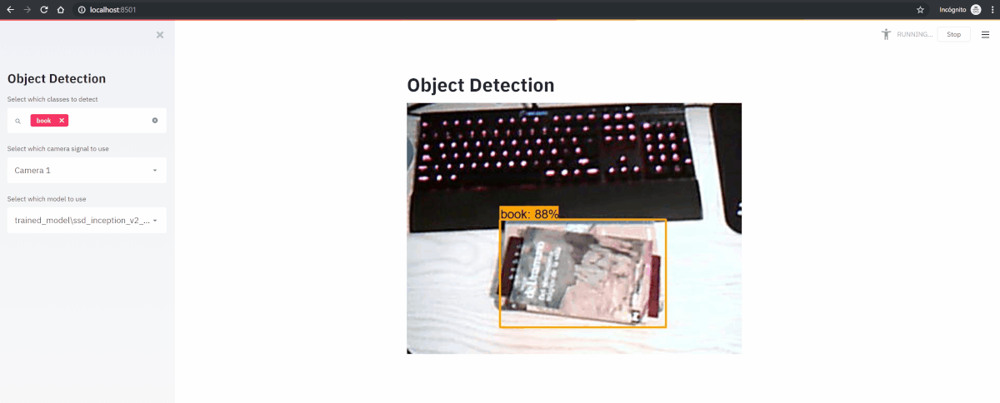

# Streamlit-TF-Real-Time-Object-Detection

Interactive Web App that performs object detection within a video stream.



## Dependencies

If you're a conda user, you can create an environment from the ```environment.yml``` file using the Terminal or an Anaconda Prompt for the following steps:

1. Create the environment from the ```environment.yml``` file:

    ```conda env create -f environment.yml```
2. Activate the new environment:
    * Windows: ```activate obj-det```
    * macOS and Linux: ```source activate obj-det``` 

3. Verify that the new environment was installed correctly:

    ```conda list```
    
You can also clone the environment through the environment manager of Anaconda Navigator.

It's mandatory to download at least a TensorFlow object detection model. Several models can be found in th [TF Model Zoo](https://github.com/tensorflow/models/blob/master/research/object_detection/g3doc/detection_model_zoo.md). The models should be placed in the *trained_model/* folder.

## Use

Within the virtual environment:

```streamlit run main.py```

A web application will open in the prompted URL. The options there are:
* **Select which classes to detect:** Multiselect to choose which of the classes that the model's been trained on (available on *label_map.pbtxt*) are going to be used in the inference. This is, only detections of the selected classes will appear in the resulting bounding boxes.
* **Select which camera signal to use:** If more than a camera is connected to the computer, the user can select which signal to be fed to the model.
* **Select which model to use:** Any TensorFlow model can be used to make predictions out of the video signal. Just select it from the *trained_model/* directory. Be sure that the model has a *frozen_inference_graph.pb* on it.

## License

This project is licensed under the MIT License - see the [LICENSE.md](LICENSE.md) file for details
